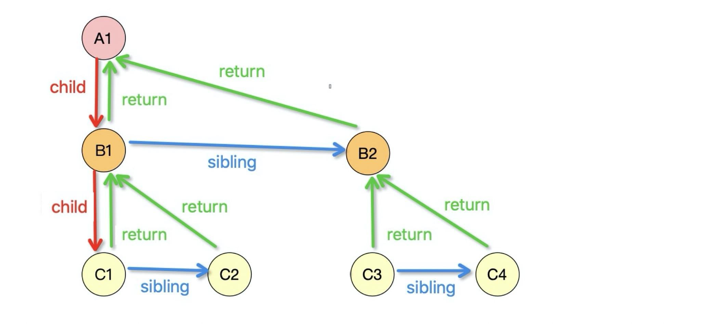

# 🚀 가상 DOM과 리액트 파이버

리액트의 특징은 바로 가상DOM이다. 이 가상DOM이 왜 만들어졌는지, 실제 DOM과 어떤 차이가 있는지 알아보도록 하자.

## 1️⃣ DOM과 브라우저 렌더링 과정

1. 브라우저는 Navigation과정을 통해 주소에 해당하는 서버에 HTML파일을 요청하고 다운로드 한다.
2. 브라우저의 렌더링 엔진에 의해 DOM과 CSSOM이 만들어지고, 자바스크립트 엔진을 통해 AST가 만들어진다.
3. AST는 DOM과 CSSOM에 적용되고, 이 DOM과 CSSOM은 결합하여 RenderTree가 만들어진다.
4. 브라우저의 렌더링 엔진에 의해 레이아웃과 페인트 과정을 통해서 픽셀 단위로 화면에 뿌려지게 된다.

## 2️⃣ 가상 DOM의 탄생 배경

1. 브라우저가 웹페이지를 렌더링하는 과정은 매우 복잡하고 많은 비용이 발생한다.
2. 따라서 사용자 인터렉션으로 인해 웹페이지가 변경되는 상황을 고려해야 한다.
3. 요소의 크기가 바뀌는 경우 레이아웃이 일어나고 이는 필연적으로 리페인팅 과정이 발생하면서 큰 비용이 발생한다.
4. 또한 DOM 변경이 일어나는 요소가 많은 자식을 가지고 있는 경우 덩달아서 자식 요소까지 바뀌기 때문에 더더욱 큰 비용이 발생한다.
5. 이러한 렌더링 이후 추가적인 렌더링 작업은 SPA에서 더욱 많아진다.
6. 이러한 문제점을 해결하기 위해 탄생한 것이 바로 가상 DOM이다.
7. 리액트는 웹페이지에 표시해야 할 DOM을 메모리제 저장하고, 실제 변경에 대한 준비가 완료되었을 때 실제 브라우저의 DOM에 반영한다.
8. 이렇게 DOM 계산을 브라우저가 아닌 메모리에서 계산하는 과정을 한 번 거치게 된다면 실제로는 여러 번 발생했을 때 렌더링 과정을 최소화할 수 있고 브라우저와 개발자의 부담을 덜 수 있다.
9. 가상 DOM에 대한 한 가지 일반적 오해는 일반적인 DOM을 관리하는 브라우저보다 무조건 빠르다는 사실이다. 이는 사실이 아니며, 가상 DOM방식은 대부분의 상황에서 충분히 빠르다는 것이다.

## 3️⃣ 가상 DOM을 위한 아키텍처, 리액트 파이버

### 리액트 파이버란?

1. 리액트에서 관리하는 자바스크립트 객체다.
2. 파이버는 파이버 재조정자 (Fiber Reconciler)가 관리한다.
3. 이는 가상DOM과 실제DOM을 비교해 변경 사항을 수집하며, 만약 이 둘 사이에 차이가 있으면 변경에 관련된 정보를 가지고 있는 파이버를 기준으로 화면에 렌더링을 요청한다.
4. React 16v에 등장하였고, 이전까진 diff 알고리즘을 통해 가상DOM과 비교하였다.
5. 과거 사용된 리액트의 조정 알고리즘은 스택 알고리즘으로 이뤄져 있었다. 스택에 렌더링에 필요한 작업들이 쌓이면 이 스택이 빌 때까지 동기적으로 작업이 이루어졌다.
6. 싱글 스레드인 자바스크립트에선 이 동기 작업은 중단될 수 없고, 다른 작업을 수행할 수도 없었다.
7. 이러한 기존 렌더링 스택의 비효율성을 타파하기 위해 리액트에서는 파이버라는 개념이 등장했다.

### 파이버는 어떻게 구성되어 있을까?

리액트 내부 코드에 작성돼 있는 파이버 객체

[react-fiber-repo](https://github.com/facebook/react/blob/main/packages/react-reconciler/src/ReactFiber.js)

```jsx
function createFiber(tag: WorkTag, pendingProps: mixed, key: null | string, mode: TypeOfMode): Fiber {
  // $FlowFixMe[invalid-constructor]: the shapes are exact here but Flow doesn't like constructors
  return new FiberNode(tag, pendingProps, key, mode);
}
```

파이버 객체 내부의 요소는 다음과 같다.

1. tag : 파이버는 하나의 element에 하나의 파이버가 생성되어 1:1 관계를 가진다. 해당 element는 tag 필드에 초기화된다.
2. stateNode: 이 속성은 파이버 자체에 대한 참조 정보를 가지고 있다.
3. child, sibling, return : 파이버 간의 관계 개념을 나타내는 속성이다.

   

4. index : 여러 형제들 사이에서 자신의 위치를 나타낸다.
5. pedingProps : 아직 처리하지 못한 props
6. memoizedProps : pendingProps를 기준으로 렌더링이 완료된 이후에 pendingProps를 memoizedProps에 저장하여 관리한다.
7. updateQueue : 상태 업데이트, 콜백 함수, DOM 업데이트 등 작업을 담아두는 Queue.
8. memoizedState : 함수 컴포넌트의 훅 목록이 저장된다.
9. alternate: 뒤이어 설명할 리액트 파이버 트리와 이어질 개념. 리액트의 트리는 두 개인데, alternate는 반대 트리의 파이버를 가리킨다.

이렇게 생성된 파이버는 state가 변경되거나 생명주기 메서드가 실행되거나 DOM의 변경이 필요한 시점 등에 실행된다.

우선순위가 높은 작업은 가능한 빠르게 처리하나, 낮은 작업을 연기시키는 등 좀 더 유연하게 처리한다. 이는 **`requestAnimationFrame`** 와 **`requestIdleCallback`** 메서드를 통해서 관리하게 된다.

[A Closer Look at React Fiber](https://www.alibabacloud.com/blog/a-closer-look-at-react-fiber_598138)

### 리액트 파이버 트리

1. 파이버 트리는 리액트에 두 개 존재한다. 현재 모습을 담은 파이버 트리인 current트리와 작업 중인 상태를 나타내는 workInProgress 트리다.
2. 리액트 파이버의 작업이 끝나면 리액트는 단순히 포인터만 변경해 workInProgress 트리를 현재 트리로 바꿔버린다. 이를 더블 버퍼링이라고 한다.
3. 이 더블 버퍼링 과정은 커밋 단계에서 수행된다.

### 파이버의 작업 순서

1. `beginWork()` 함수를 통해 파이버 작업을 수행한다. 더 이상 자식이 없는 파이버를 만날 때까지 트리 형식으로 시작된다.
2. 1번 작업이 끝나면 `completeWork()` 함수를 실행해 파이버 작업의 완료를 알린다.
3. 형제가 있다면 형제로 넘어가고 아니라면 return으로 돌아가 자신의 작업이 완료되었음을 알린다.

setState등과 같은 이유로 업데이트가 발생한다면, workInProgress 트리를 다시 빌드하는데, 여기서 파이버 객체 덕분에 새로 요소를 생성하는 것이 아니라, 업데이트된 props만 받아서 파이버 내부에서 처리하여 리소스를 아낄 수 있다는 것이다.

즉 가급적 객체를 새롭게 만들기보다, 기존에 있는 객체를 재활용하기 위한 기술이라고 생각이 된다.

그리고 과거 동기식으로 처리한 업데이트 과정과 달리 파이버를 통해서 우선순위가 높은 업데이트를 우선적으로 처리하고, 이 과정을 일시 중단하거나 새롭게 만들거나, 폐기할 수 있게 된 것이다.

## 4️⃣ 파이버와 가상 DOM

1. 리액트 컴포넌트에 대한 정보를 1:1로 가지고 있는 것이 파이버이다.
2. 파이버는 리액트 아키텍처 내부에서 비동기로 이뤄진다.
3. 이러한 비동기 작업과 달리 실제 브라우저의 구조인 DOM에 반영하는 것은 동기적으로 일어나야 한다.
4. 그렇기에 이 작업을 가상에서, 즉 메모리에서 먼저 수행하여 최종적인 결과물만 실제 브라우저 DOM에 적용하는 것이다.
5. 가상DOM이라는 표현을 사용하지만, 엄밀히 말하면 리액트 파이버는 리액트 네이티브와 같은 브라우저가 아닌 환경에서도 사용하기 때문에 가상DOM과 동일한 개념은 아니다.
