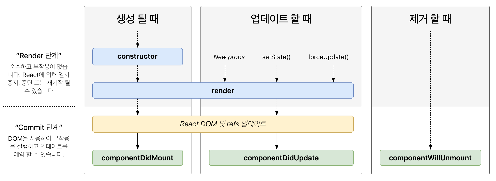

## 🚀 클래스형 컴포넌트와 함수형 컴포넌트

## 1️⃣ 클래스 컴포넌트

```jsx
import React from "react";

class SampleComponent extends React.Component {
  render() {
    return <h2>Sample Component</h2>;
  }
}
```

1. 오래된 코드의 유지보수, 오래된 라이브러리를 사용할 때 도움을 얻기 위해서 기본적인 클래스 컴포넌트의 이해가 필요하다.
2. 다음과 같은 클래스를 상속받아 컴포넌트를 만들 수 있다.

   1. React.Component
   2. React.PureComponent

   이 둘의 차이점은 `shouldComponentUpdate` 를 다루는 데 있다.

```tsx
import React from 'react';

//Prop 타입 정의
interface SampleProps {
	required?: boolean;
	text: string;
}

// State 타입 정의
interface SampleProps {
	count: number;
	isLimited?; boolean;
}

// Component에 제네릭으로 props와 state를 순서대로 넣어준다
class SampleComponent extends React.Component<SampleProps, SampleState> {
	// constructor에서 props를 넘겨주고, state의 기본값을 설정한다.

	private constructor(props: SampleProps) {
		super(props)
		this.state = {
			count: 0,
			isLimited: false,
		}
	}

	private handleClick = () => {
		count newValue = this.state.count + 1
		this.setState({ count: newValue, isLimited: newValue >= 10 })
	}

	render() {
		const {
			props: { required, text },
			state: { count, isLimited },
		} = this

		return (
			<h2>
				Sample Compnent
				<div>{required ? '필수' : '필수아님'}</div>
				<div>문자: {text}</div>
				<div>count: {count}</div>
				<button onClick={this.handleClick} disabled={isLimited}>
					증가
				</button>
			</h2>
		)
	}
}
```

1. **constructor**를 통해서 state를 초기화할 수 있다.
   1. 간혹 constructor를 쓰지 않고 state를 초기화한 코드가 있을 것이다.
   2. 이는 ES2022에 추가된 클래스 필드 덕분에 가능한 문법이다. 이는 바벨의 `@babel/plugin-proposal-class-properties`를 사용해 트랜스파일을 거쳐야 한다.
2. **props**는 특정 속성을 전달하는 용도로 쓰인다.
3. **state**는 클래스 컴포넌트 내부에서 관리하는 값을 의미한다.
4. **메서드**들은 render함수 내부에서 사용되는 함수이며, 보통 DOM에서 발생하는 이벤트와 사용된다.

   1. 위 예제의 `handleClick` 함수는 화살표 함수가 사용되었는데 이는 this바인딩 때문이다. 화살표 함수를 사용하지 않는다면 다음과 같이 표현할 수 있다.

   ```tsx
   class SampleComponent extends React.Component<SampleProps, SampleState> {

   	private constructor(props: SampleProps) {
   		super(props)
   		this.state = {
   			count: 0,
   			isLimited: false,
   		}

   		this.handleClick = this.handleClick.bind(this) // 현재 클래스 바인딩
   	}

   	private handleClick () {
   		count newValue = this.state.count + 1
   		this.setState({ count: newValue, isLimited: newValue >= 10 })
   	}
   ```

### ❗️클래스 컴포넌트의 생명주기 메서드

생명주기 메서드가 실행되는 시점은 크게 3가지로 나눌 수 있다.

1. **마운트(mount)**: 컴포넌트가 마운트(생성)되는 시점
2. **업데이트(update)**: 이미 생성된 컴포넌트의 내용이 변경(업데이트)되는 시점
3. **언마운트(unmount)**: 컴포넌트가 더 이상 존재하지 않는 시점
4. **render()**
   1. UI를 렌더링하기 위해서 쓰인다.
   2. `render`함수는 항상 순수해야 한다. (`render`함수 내부에선 `setstate`를 사용하면 안된다)
5. **componentDidMount()**
   1. 마운트되고 호출되는 생명주기 메서드.
   2. `render`와 다르게 `setState`로 state값을 변경하는 것이 가능하다.
   3. `setState`를 호출했다면 다시 한번 렌더링을 시도하는데, 브라우저가 실제로 UI를 업데이트하기 전에 실행되어 사용자는 알 수 없다.
   4. 성능 문제를 일으킬 수 있으므로 주의가 필요한 메서드.
6. **componentDidUpdate()**

   1. 업데이트 이후 바로 호출되는 생명주기 메서드.
   2. `setState`를 사용할 수 있다.
   3. 적절한 조건문을 사용하지 않는다면 계속해서 호출될 것이다.

   ```tsx
   class Component extends Component<Props, State> {
     // ...
     componentDidUpdate(prevProps: Props, prevState: State) {
       // 적절한 조건문이 없다면 props가 변경되는 매 순간 fetchData 함수가 호출될 것이다.
       if (this.props.userName !== prevProps.userName) {
         this.fetchData(this.props.userName);
       }
     }
   }
   ```

7. **componentWillUnmount()**

   1. 언마운트되거나 더 이상 사용되지 않기 직전에 호출되는 생명주기 메서드.
   2. `setState`함수를 호출할 수 없다.
   3. 이벤트를 지우거나 API호출을 취소하거나 타이머를 지우는 등 작업에 유용하다.

   ```tsx
   class Component extends Component<Props, State> {
   // ...
   	componentWillUnmount**() {**
   		window.removeEventListner('resize', this.resizeListener)
   		clearInterval(this.intervalId)
   	**}
   }**
   ```

8. **shouldComponentUpdate()**
   1. state나 props의 변경으로 리액트 컴포넌트가 다시 리렌더링 되는 것을 막고싶다면 이 메서드를 사용할 수 있다.
   2. `setState`를 사용해도 컴포넌트가 렌더링되지 않는다.
   3. 성능 최적화 상황에서만 고려해야 한다.

      ```tsx
      class Component extends Component<Props, State> {
      // ...
      	shouldComponentUpdate**(**nextProps: Props, nextState: State**) {
      	//** true인 경우, 즉 props 혹은 state가 같지 않는 경우에만 컴포넌트를 업데이트 한다.
      		****return this.props.title !== nextProps.title || this.state.input !== nextState.input
      	**}
      }**
      ```

   4. **Component 클래스와 PureCompoent 클래스의 차이가 바로 이 생명주기 메서드다.**
      1. Component의 경우 state가 업데이트 되는 대로 렌더링이 일어난다.
      2. PureCompoent의 경우 state가 업데이트 되어도 값이 바뀌지 않는다면 렌더링을 수행하지 않는다. (얕은 비교를 수행해 결과가 다를 때만 렌더링을 수행한다.)
      3. 모두 PureCompoent로 이루어져 있다면 좋을 것 같지만, 만약 컴포넌트가 얕은 비교를 했을 때 일치하지 않는 일이 더 잦다면 성능에 역효과를 줄 수 있다.
9. **static getDerivedStateFromProps()**

   1. `render`를 호출하기 직전에 호출되는 생명주기 메서드.
   2. static으로 선언되어 this에 접근할 수 없다.
   3. 여기서 반환하는 객체의 내용은 state로 들어가게 된다. null을 반환하면 아무일도 일어나지 않는다.

   ```tsx
   class Component extends Component<Props, State> {
   // ...
   	static getDerivedStateFromProps**(**nextProps: Props, nextState: State**) {
   		//** 다음에 올 props를 바탕으로 현재 state를 변경할 수 있다.
   		****if(props.name !== state.name){
   			return {
   				name: props.name,
   			}
   		}

   		****return null
   	**}
   }**
   ```

10. getSnapShotBeforeUpdate()

    1. DOM이 업데이트 되기 직전 호출되는 생명주기 메서드.
    2. 여기서 반환되는 값은 `componentDidUpdate`로 전달된다.
    3. DOM이 렌더링 되기 전에 윈도우 크기를 조절하거나 스크롤 위치를 조정하는 등 작업에 유용하다.

    ```tsx
    class Component extends Component<Props, State> {
    // ...
    	getSnapShotBeforeUpdate**(**prevProps: Props, prevState: State**) {
    		//** props로 넘겨받은 배열의 길이가 이전보다 길다면 현재 스크롤 높이 값을 반환한다.
    		****if(prevProps.list.length < this.props.list.length){
    			const list = this.listRef.current;
    			return list.scrollHeight - list.scrollTop
    		}

    		****return null
    	**}**

    	componentDidUpdate(prevProps: Props, prevState: State, snapShot: Snapshot**) {
    		//** snapshot을 통해 스크롤 위치를 조정하여 기존 아이템이 스크롤에서 밀리지 않게 한다.
    		****if(snapshot !== null){
    			const list = this.listRef.current;
    			list.scrollTop = list.scrollHeight - snapshot
    		}
    	**}
    }**
    ```

    1. 위 예제는 채팅방에서는 새로운 메시지가 추가될 때 스크롤 위치를 유지하는 데 사용할 수 있다.
    2. 예시 코드에서 보듯이, 이전 props의 list 길이와 현재 props의 list 길이를 비교하여 새로운 메시지가 추가되었는지 확인한다.
    3. 새로운 메시지가 추가되었다면 현재 스크롤 높이 값을 반환하여 이후 componentDidUpdate()에서 활용할 수 있다.

### ❗️ 지금까지 언급한 생명주기 메서드 정리



1. **static getDerivedStateFromError()**

   1. 자식 컴포넌트에서 에러가 발생했을 때 호출되는 에러 메서드다.
   2. 반드시 state값을 반환해야 한다.

   ```tsx
   class Component extends Component<Props, State> {
   // ...
   	static getDerivedStateFromError**(**error: Error**) {**
   		return {
   				hasError: true,
   				errorMessage: error.toString();
   		}
   	**}
   }**
   ```

2. **componentDidCatch()**

   1. 자식 컴포넌트에서 에러가 발생했을 때 실행되며, `getDerivedStateFromError` 에서 state를 결정한 이후 실행된다.
   2. 리액트에서 에러 발생시 메서드에 제공되는 에러 정보를 이용할 수 있다.
   3. 개발모드에서는 모든 에러가 window에 전파되지만, 프로덕션 모드에서는 `componentDidCatch` 에서 잡지 못한 에러만 window까지 전파된다.

   ```tsx
   class Component extends Component<Props, State> {
   // ...
   	static getDerivedStateFromError**(**error: Error**) {**
   		return {
   				hasError: true,
   				errorMessage: error.toString();
   		}
   	**}**

   	componentDidCatch(error: Error, info: ErrorInfo) {
   		console.log(error);
   		console.log(info)
   	}
   **}**
   ```

### ❗️ 클래스 컴포넌트의 한계

1. **데이터의 흐름을 추적하기 어렵다** : 서로 다른 메서드에서 state의 업데이트가 일어고, 메서드의 순서가 강제되어 있지 않기 때문이다.
2. **애플리케이션 내부 로직의 재사용이 어렵다** : 공통 로직이 많아질수록 이를 감싸는 고차 컴포넌트, 내지는 props가 많아지는 래퍼 지옥(wrapper hell)에 빠져들 위험이 있다. 상속으로 중복코드를 관리할 수 있지만, 이 역시 상속되는 클래스의 흐름을 쫓아야 하기 때문에 복잡도가 증가한다.
3. **클래스는 함수에 비해 상대적으로 어렵다** : 프로토타입 기반인 자바스크립트의 특징으로 클래스보다 함수에 더 익숙하다.
4. **핫 리로딩을 하는 데 상대적으로 불리하다** : 핫 리로딩(hot reloading)이란 코드에 변경 사항이 발생했을 때 앱을 다시 시작하지 않고 해당 변경된 코드만 업데이트해 변경 사항을 빠르게 적용하는 기법. 개발 단계에서 많이 사용되는 것. 클래스는 이 핫 리로딩에 상대적으로 불리하다. (클래스는 최초 렌더링 시 instance를 생성하고, 내부에서 state를 관리하는데, instance 내부의 render를 수정하게 되면 이를 반영하는 방법은 오직 새로운 instance를 만드는 것 뿐이기 때문이다.)

## 2️⃣ 함수 컴포넌트

```tsx
import React from "react";

//Prop 타입 정의
interface SampleProps {
  required?: boolean;
  text: string;
}

export function SampleComponent({ required, text }: SampleProps) {
  const [count, setCount] = useState(0);
  const [isLimited, setIsLimited] = useState(false);

  function handleClick() {
    const newValue = count + 1;
    setCount(newValue);
    setIsLimited(newValue >= 10);
  }

  return (
    <h2>
      Sample Compnent
      <div>{required ? "필수" : "필수아님"}</div>
      <div>문자: {text}</div>
      <div>count: {count}</div>
      <button onClick={handleClick} disabled={isLimited}>
        증가
      </button>
    </h2>
  );
}
```

함수 컴포넌트는 this바인딩을 조심할 필요도 없고, state는 객체가 아닌 각각의 원시값으로 관리되어 사용하기 편해졌다.

### ❗️ 함수 컴포넌트 vs 클래스 컴포넌트

1. **생명주기 메서드의 부재**
   1. `useEffect` 훅을 이용해 `componentDidMount`, `componentDidUpdate`, `componentWillUnmount` 를 비슷하게 구현할 수 있다.
2. **함수 컴포넌트와 렌더링된 값**

   1. 함수 컴포넌트는 렌더링된 값을 고정하고, 클래스 컴포넌트는 그렇지 못하다.

   [How Are Function Components Different from Classes? — overreacted](https://overreacted.io/how-are-function-components-different-from-classes/)

### ❗️ 클래스 컴포넌트를 공부해야 할까?

1. 클래스 컴포넌트는 사라질 계획은 없어 보인다.
2. 많은 코드들이 클래스 컴포넌트로 작성돼었으며, 이러한 흐름을 알기 위해서는 어느정도 클래스 컴포넌트에 대한 지식도 필요하다.
3. 일부 클래스 컴포넌트의 메서드, 특히 자식 컴포넌트에서 발생한 에러에 대한 처리는 현재 클래스 컴포넌트로만 가능하다.
