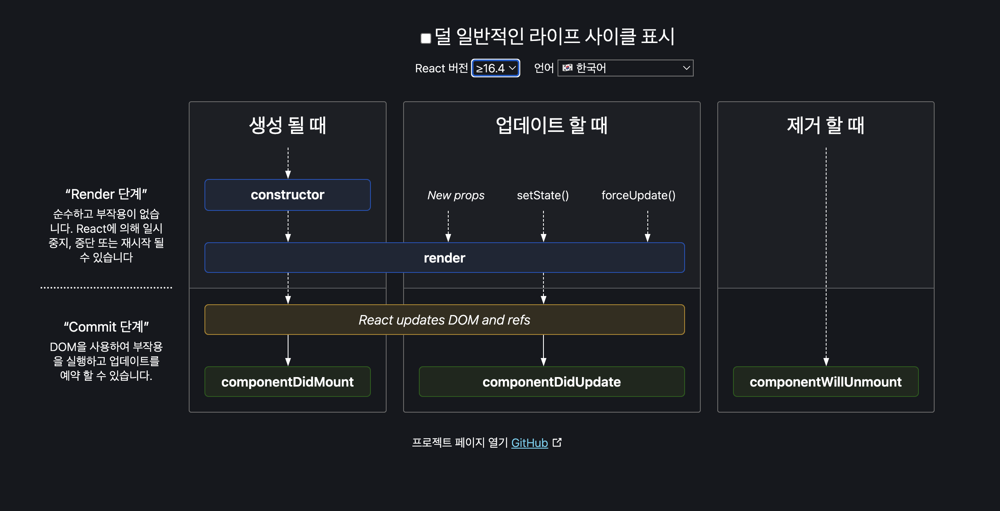

# 🚀 렌더링은 어떻게 일어나는가?

1. 리액트의 렌더링은 브라우저가 렌더링에 필요한 DOM 트리를 만드는 과정을 의미한다.
2. 이 렌더링 과정은 시간과 리소스를 소비해 수행하는 과정이다.
3. 이 비용은 모두 웹 애플리케이션을 방문하는 사용자에게 청구되며, 시간이 길고 복잡해질 수록 사용성을 저해한다.
4. 때문에 개발자는 렌더링 과정을 최소한으로 줄이기 위하여 렌더링 과정을 잘 숙지하고 있어야 한다.

## 1️⃣ 리액트의 렌더링이란?

1. 브라우저에서도 사용되는 용어이므로 두 가지를 혼동해서 사용해선 안된다.
2. 리액트에서의 렌더링이란 리액트 애플리케이션 트리 안에 있는 모든 컴포넌트들이 현재 자신들이 가지고 있는 props와 state의 값을 기반으로 어떻게 UI를 구성하고, 이를 바탕으로 어떤 DOM 결과를 브라우저에 제공할 것인지 계산하는 일련의 과정을 의미한다.

## 2️⃣ 리액트의 렌더링이 일어나는 이유

1. **최초 렌더링** : 사용자가 처음 애플레키에션에 진입하였을 때 최초 렌더링이 수행된다.
2. **리렌더링** : 최초 렌더링이 발생한 이후 발생하는 렌더링

   1. 클래스 컴포넌트의 `setState`가 실행되는 경우.
   2. 클래스 컴포넌트의 `forceUpdate`가 실행되는 경우. `render`가 state나 props가 아닌 다른 곳에 의존하고 있어 자동으로 렌더링이 수행되지 않는 상황에서 리렌더링을 발생하고 싶다면 이 `forceUpdate`를 실행해 리렌더링을 발생시킬 수 있다.
   3. 함수 컴포넌트의 `useState()`의 두 번째 배열 요소인 setter가 실행되는 경우.
   4. 함수 컴포넌트의 `useReducer()`의 두 번째 배열 요소인 dispatch가 실행되는 경우.
   5. 컴포넌트의 key props가 변경되는 경우.

      1. 리액트에서 배열에 key를 사용하지 않으면 경고가 출력된다. 왜 key가 필요할까?

         → 리액트에서의 key는 리렌더링이 발생하는 동안 형제 요소들 사이에 동일한 요소를 식벽하는 값이다. 동일한 자식 컴포넌트가 여러 개 있는 구조에서는, 리렌더링이 발생했을 경우, current 트리와 workInProgress트리 사이에 어떠한 컴포넌트가 변경이 있었는지 구별해야 한다. 이 때 사용되는 것.

   6. props가 변경되는 경우.
   7. 부모 컴포넌트가 렌더링될 경우. 부모 컴포넌트가 리렌더링 되면 자식 컴포넌트는 무조건 리렌더링 된다.

**리액트에서의 리렌더링은 위의 경우 이외에는 발생하지 않는다. redux와 같은 외부 라이브러리의 경우 각자의 방법으로 상태를 관리해 주지만 결국 위의 방법을 이용해 리렌더링을 발생시킨다.**

## 3️⃣ 리액트의 렌더링 프로세스

1. 리액트는 컴포넌트의 루트에서부터 차근차근 아래쪽으로 내려가면서 업데이트가 필요하다고 지정돼 있는 모든 컴포넌트를 찾고 리렌더링한다.
2. 클래스 컴포넌트의 경우 내부의 `render` 함수를, 함수형 컴포넌트의 경우 그 함수 자체를 호출한다.

## 4️⃣ 렌더와 커밋

### **렌더**

1. 컴포넌트를 렌더링하고 변경 사항을 계산하는 모든 작업을 말한다.
2. 컴포넌트를 실행해 (`render`또는 return) 결과와 가상 DOM을 비교하는 과정을 거쳐 변경이 필요한 컴포넌트를 체크한다.
3. 여기서 비교하는 것은 세 가지다. type, props, key

### **커밋**

1. 렌더 단계의 변경 사항을 실제 DOM에 적용해 사용자에게 보여주는 과정.
2. 이 단계가 끝나고 나서야 브라우저의 렌더링이 발생한다. (브라우저의 렌더링과 리액트의 렌더링을 구분하자)
3. 이렇게 만들어진 모든 DOM 노드 및 인스턴스를 가리키도록 리액트 내부의 참조를 업데이트한다.
4. 클래스 컴포넌트의 경우 `componentDidMount` `componentDidUpdate` 메서드를 생성하고, 함수 컴포넌트의 경우 `useLayoutEffect` 훅을 호출한다.
5. **중요한 것은 리액트의 렌더링이 일어난다고 하더라도 무조건 DOM 업데이트가 일어나는 것은 아니라는 것이다.**
6. 렌더링을 수행했지만 변경사항이 없다면 커밋 되지 않는다.

