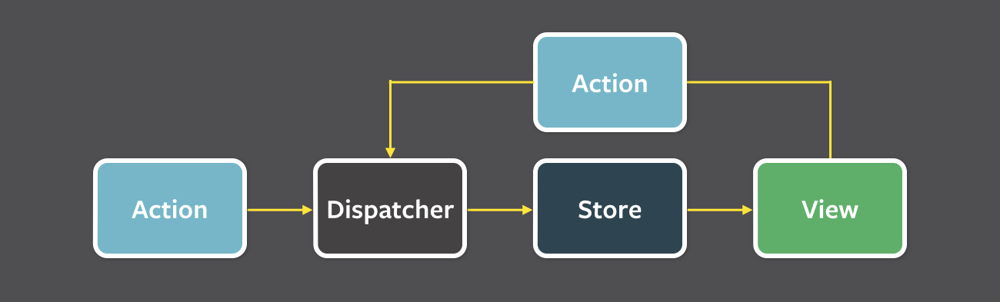

# 🚀 상태 관리는 왜 필요한가?

### ❓상태란 무엇일까?

1. 웹 애플리케이션을 개발할 때의 상태란, 애플리케이션의 시나리오에 따라 지속적으로 변경될 수 있는, 어떠한 의미를 지닌 값을 뜻한다.
2. UI적인 상태로는, 다크/라이트 모드, 라디오를 비롯한 각족 input 알림창의 노출 여부 등이 있다.
3. URL의 상태로는, 라우트의 param값이 상태에 해당한다.
4. 폼(form)에서도, 로딩 중인지, 제출 되었는지, 접근이 불가능한지, 유효한지에 대한 것들이 상태 관리에 해당한다.
5. 클라이언트에서 서버로 요청을 통해 가져온 값도 상태로 볼 수 있다.

## 1️⃣  Flux패턴의 등장

1. 애플리케이션이 비대해지고, 상태(데이터)가 많아짐에 따라서 상태가 변했는지 등을 추적하는 것이 매우 어려워 졌다.
2. 페이스북 팀은 이러한 문제의 원인을 양방향 데이터 바인딩으로 보고, 이를 단방향으로 변경하는 것을 제안하는데 이것이 Flux패턴의 시작이다.
3. 용어로는 다음과 같다.
   1. 액션 (Action) : 어떠한 작업을 처리할 액션, 액션 타입과 데이터를 각각 정의해 이를 디스패쳐로 보낸다.
   2. 디스패쳐 (Dispatcher) : 액션을 스토어에 보내는 역할. 액션에서 정의한 타입과 데이터를 스토어에 보낸다.
   3. 스토어 (Store) :실제 상태에 따른 값과 상태를 변경할 수 있는 메서드를 가진다. 액션 타입에 따라 어떻게 변경할 지를 가지고 있다.
   4. 뷰 (View) : 리액트 컴포넌트에 해당한다.



1. 이러한 단방향 데이터 흐름 역시 코드의 양이 많아진다는 단점이 있지만, 데이터의 흐름을 추적하기 쉽고 이해하기 쉬운 코드를 작성할 수 있게 된다는 장점이 있다.

```tsx
type StoreState = {
  count: number;
};

type Action = { type: "add"; payload: number };

function reducer(prevState: StoreState, action: Action) {
  const { type: ActionType, payload } = action;
  if (ActionType === "add") {
    return { count: prevState.count + payload };
  }

  throw new Error("Unexpected Action");
}

export default function App() {
  const [state, dispatcher] = useReducer(reducer, { count: 0 });

  function handleClick() {
    dispatcher({ type: "add", payload });
  }

  return; //...
}
```

## 2️⃣ ReactQuery와 SWR

1. 두 라이브러리 모두 HTTP요청에 특화된 상태 관리 라이브러리이다.
2. 캐싱을 통해 데이터 요청을 반복적으로 하지 않고, 데이터를 저장하여 관리한다.
3. 우리가 알고 있는 상태 관리 라이브러리는 아니지만, 제한적인 목적의 상태 관리 라이브러리라 할 수 있다.

[[React] React Query와 SWR의 차이?](https://lurgi.tistory.com/136)
