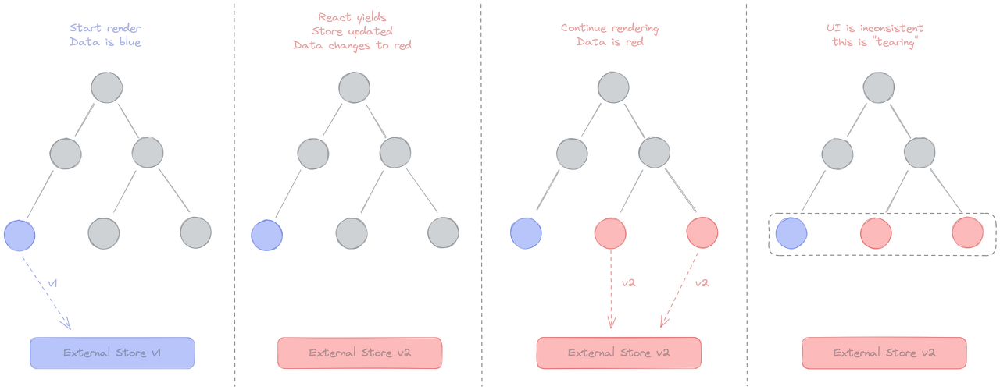

# 🚀 리액트 18 버전 살펴보기

## 1️⃣ 새로 추가된 훅 살펴보기

### ❗️ useId

1. 컴포넌트별로 유니크한 값을 생성하는 새로운 훅이다.
2. SSR과 CSR의 결과값이 다르면 에러가 발생한다.
3. 서비스에서 컴포넌트별로 고유한 값을 사용해야 한다면 반드시 하이드레이션을 고려해야 해서 17버전까지 굉장히 까다로운 작업이었다.
4. useId를 통해 서로 다른 컴포넌트혹은 같은 컴포넌트에서도 인스턴스가 다르다면 랜덤값을 생성해낼 수 있다.

### ❗️useTransition

1. UI의 변경을 가로막지 않고 상태를 업데이트할 수 있는 리액트 훅.
2. 업데이트를 긴급하지 않은 것으로 간주해 무거운 렌더링 작업을 조금 미룰 수 있으며, 사용자에게 조금 더 나은 사용자 경험을 제공할 수 있다.

```tsx
//App.tsx
type Tab = 'about' | 'posts' | 'contact'

export default function App() {
	const [tab, setTab] = useState<Tab>('about')

	function selectTab(nextTab: Tab){
		setTab(nextTab);
	}

	return (
		<>
			<TabButton isActive={tab === 'about'} onClick={() => selectTab('about')}>
			<TabButton isActive={tab === 'posts'} onClick={() => selectTab('posts')}>
			<TabButton isActive={tab === 'contact'} onClick={() => selectTab('contact')}>

			{/*일반적인 컴포넌트 */}
			{tab === 'about' && <About />}
			{/*매우 무거운 컴포넌트 컴포넌트 */}
			{tab === 'posts' && <Post />}
			{/*일반적인 컴포넌트 */}
			{tab === 'contact' && <Contact />}
		</>
	)
}
```

1. 위 코드는 세 개의 탭 중 하나의 선택된 탭을 보여주는 코드다.
2. Post는 내부에 굉장히 느린 작업이 포함된 요소라고 하자.
3. Post를 선택한 후에 바로 Contact를 선택하더라도, Post를 렌더링 하기 위해 잠깐 브라우저가 멈춘 듯한 모습을 보인다.
4. useTransition을 사용하면 이런 문제를 해결할 수 있다.

```tsx
//App.tsx
type Tab = 'about' | 'posts' | 'contact'

export default function App() {
	const [tab, setTab] = useState<Tab>('about')
	const [isPending, startTransition] = useTransition();

	function selectTab(nextTab: Tab){
		startTransition(()=>{
			setTab(nextTab);
		})
	}

	return (
		<>
			<TabButton isActive={tab === 'about'} onClick={() => selectTab('about')}>
			<TabButton isActive={tab === 'posts'} onClick={() => selectTab('posts')}>
			<TabButton isActive={tab === 'contact'} onClick={() => selectTab('contact')}>

			{isPending ? <div>로딩중...</div> :(
				<>
					{/*일반적인 컴포넌트 */}
					{tab === 'about' && <About />}
					{/*매우 무거운 컴포넌트 컴포넌트 */}
					{tab === 'posts' && <Post />}
					{/*일반적인 컴포넌트 */}
					{tab === 'contact' && <Contact />}
				</>)
		</>
	)
}
```

1. startTransition은 긴급하지 않은 상태 업데이트로 간주할 set함수를 넣어둘 수 있는 함수를 인수로 받는다.
2. 즉각 렌더링을 시작하지 않고, 마치 async await처럼 비동기로 렌더링 한다.
3. useTransition은 리액트 18의 변경 사항의 핵심 중 하나인 **“동시성(concurrency)”**을 다룰 수 있는 새로운 훅이다
4. 단순히 startTransition을 바로 import할 수 있다.
5. startTransition 내부는 반드시 setState와 같은 상태를 업데이트 하는 함수와 관련된 작업만 넘길 수 있다.
6. 만약 props나 사용자 정의 훅에서 반환하는 값 등을 사용하고 싶다면 useDeferredValue를 사용한다.
7. startTransition 내부 setState는, 다른 모든 동기 상태 업데이트로 인해 실행이 지연될 수 있다.
8. startTransition으로 넘겨주는 함수는 반드시 동기함수이어야 한다.

### ❗️ useDeferredValue

1. 리렌더링이 급하지 않은 부분을 지연할 수 있게 도와주는 훅이다.
2. 디바운스와 비슷하지만, 디바운스 대비 몇 가지 장점이 있다.

   1. 디바운스는 고정 지연 시간을 필요로 하지만, useDeferredValue는 지연 시간 필요 없이 첫 번째 렌더링이 완료된 이후 useDeferredValue로 지연된 렌더링을 수행한다.
   2. 이 지연된 렌더링은 중단할 수도 있으며, 사용자의 인터렉션을 차단하지도 않는다.

   ```tsx
   import React, { useState, useDeferredValue } from "react";

   function FilteredList() {
     const [filter, setFilter] = useState("");
     const deferredFilter = useDeferredValue(filter);

     const handleChange = (event) => {
       setFilter(event.target.value);
     };

     // 실제 필터링 로직, 예를 들어 대량의 데이터에서 필터링을 수행
     const filteredItems = heavyFilteringFunction(deferredFilter);

     return (
       <div>
         <input type="text" value={filter} onChange={handleChange} placeholder="검색..." />
         <ul>
           {filteredItems.map((item) => (
             <li key={item.id}>{item.name}</li>
           ))}
         </ul>
       </div>
     );
   }

   function heavyFilteringFunction(filter) {
     // 여기에는 실제로 데이터를 필터링하는 로직이 포함되며, 이 로직은 성능이 중요함
     // 이 예에서는 간단히 목록을 반환한다고 가정
     const largeDataSet = [...Array(10000).keys()].map((i) => ({ id: i, name: `Item ${i}` }));
     return largeDataSet.filter((item) => item.name.includes(filter));
   }

   export default FilteredList;
   ```

### ❗️ useSyncExternalStore

1. 일반적 애플리케이션 코드를 작성할 땐 사용할 일이 별로 없는 훅이지만, 라이브러리를 만들 때 사용할 수 있는 훅이다.
2. useTransition, useDeferredValue의 훅처럼 렌더링을 일시 중지하거나, 뒤로 미루는 등의 최적화가 가능해지면서, **동시성 이슈**가 나타나게 된다. 이를 **테어링 현상**이라고 한다.



1. 리액트에서 관리할 수 없는 외부 데이터 소스라면, 리액트에서 추구하는 동시성 처리에 추가돼 있지 않다면 이 테어링 현상이 발생할 수 있다. 이 문제를 해결하기 위한 훅이 바로 useSyncExternalStore 훅이다.

```tsx
import React from "react";
import { useSyncExternalStore } from "react";

// 외부 데이터 소스를 시뮬레이션하는 객체
const externalDataSource = {
  data: 0,
  listeners: new Set(),
  subscribe(listener) {
    this.listeners.add(listener);
    return () => this.listeners.delete(listener);
  },
  notify() {
    this.listeners.forEach((listener) => listener());
  },
  increment() {
    this.data += 1;
    this.notify();
  },
};

// useSyncExternalStore를 사용하여 외부 데이터 소스와 동기화하는 훅
function useExternalData() {
  return useSyncExternalStore(
    // 구독 함수
    externalDataSource.subscribe,
    // 스냅샷 선택 함수
    () => externalDataSource.data
  );
}

function ExternalDataComponent() {
  const data = useExternalData();

  return (
    <div>
      <p>Current data: {data}</p>
      <button onClick={() => externalDataSource.increment()}>Increment Data</button>
    </div>
  );
}

export default ExternalDataComponent;
```

1. 특히 window.innerWidth와 같은 경우, 서버사이드에서는 해당 값을 추적할 수 없으므로 0을 제공할 수 있다.

```tsx
function WindowWidthComponent() {
  // 초기 width 값을 0으로 설정
  const [width, setWidth] = useState(0);

  useEffect(() => {
    // 컴포넌트가 마운트된 후에 window 객체가 존재하는지 확인
    // 클라이언트 측 코드만 실행
    const updateWidth = () => {
      setWidth(window.innerWidth);
    };

    // 창 크기가 변경될 때마다 updateWidth 함수를 호출
    window.addEventListener('resize', updateWidth);

    // 초기 렌더링 시에 창 크기를 설정
    updateWidth();

    // 컴포넌트가 언마운트될 때 이벤트 리스너 제거
    return () => window.removeEventListener('resize', updateWidth);
  }, []);
  // ...
```

1. 서버사이드에서는 0이지만, 클라이언트에서는 window.innerWidth값을 사용하기 때문에 테어링 현상이 발생할 수 있다.
2. 이를 useSyncExternalStore훅을 사용함으로써 해결할 수 있다는 것.

---

1. **wi**ndow.innerWidth와 useSyncExternalStore: `window.innerWidth`와 같은 브라우저 전용 속성은 서버사이드에서 접근할 수 없으므로 SSR 환경에서는 초기 값으로 `0`을 사용하거나 적절한 기본값을 제공해야 합니다. 하지만 `useSyncExternalStore`를 사용하여 `window.innerWidth`를 관리하는 것은 일반적인 사용 사례가 아닙니다. `useSyncExternalStore`는 주로 외부 데이터 소스의 상태를 관리하기 위해 사용되며, `window.innerWidth` 같은 UI/환경 상태를 관리하기 위해서는 다른 접근 방식을 고려해야 합니다.
2. React의 클라이언트-사이드 환경에서의 처리: 서버사이드에서 기본 값을 제공하고 클라이언트 사이드에서 실제 값으로 업데이트하는 것은 일반적인 패턴입니다. `window.innerWidth`는 클라이언트 측에서만 접근 가능하므로, 컴포넌트가 클라이언트에서 실행될 때 이 값을 사용하여 UI를 조정할 수 있습니다.

요약하자면, `useSyncExternalStore`는 외부 데이터 소스와의 동기화를 위해 설계되었으며, `window.innerWidth` 같은 환경변수를 처리하는 것은 이 훅의 주된 목적이 아닙니다. 서버사이드 렌더링에서 초기값을 설정하고, 클라이언트 측에서 실제 환경 값을 활용하는 것이 일반적인 접근 방식입니다.

### ❗️useInsertionEffect

1. 이 훅은 CSS-in-js 라이브러리를 위한 훅이다.
2. 서버 사이드 렌더링 이전에 <style> 태그에 삽입하는 작업이 있다. 이는 굉장히 무거운 작업인데, 리액트17과 styled-components에서 클라이언트 렌더링 시에 이러한 작업이 발생하지 않도록 서버 사이드에서 스타일 코드를 삽입했다.
3. 이 작업을 훅으로 처리하는 것은 쉽지 않았는데, 이를 도와주는 훅이 바로 useInsertionEffect.
4. 기본적인 훅의 사용법은 useEffect와 동일하다.
5. 라이브러리를 작성하는 경우가 아니면 참고만 하자.

### **실행 순서 요약**

- **`useInsertionEffect`** - 렌더링 프로세스 초기에 DOM이 실제로 업데이트 되기 전에 실행됩니다.
- **`useLayoutEffect`** - DOM 업데이트 직후, 화면에 그리기 전에 실행됩니다.
- **`useEffect`** - 화면에 그리기가 완료된 후, 비동기적으로 실행됩니다.

## 2️⃣  자동 배치(Automatic Batching)

1. 리액트가 여러 상태 업데이트를 하나의 리렌더링으로 묶어서 성능을 향상시키는 방법.
2. 한 번에 두 개의 state를 동시에 업데이트한다고 했을때, 자동 배치를 통해 이를 하나의 리렌더링으로 묶어서 수행할 수 있다.

```tsx
import React, { useState } from "react";

function AutoBatchingComponent() {
  const [count, setCount] = useState(0);
  const [flag, setFlag] = useState(false);
  const [text, setText] = useState("");

  const handleClick = () => {
    // 세 가지 상태 업데이트가 하나의 렌더링으로 처리됩니다.
    setCount(count + 1);
    setFlag(!flag);
    setText("Updated");
  };

  return (
    <div>
      <h1>Count: {count}</h1>
      <h2>Flag: {flag.toString()}</h2>
      <h3>Text: {text}</h3>
      <button onClick={handleClick}>Update States</button>
    </div>
  );
}

export default AutoBatchingComponent;
```

## 3️⃣ 정리

React 18에서는 동시성 렌더링(Concurrent Rendering)이라는 주요 기능이 도입되어 React 애플리케이션의 성능과 사용자 경험을 크게 개선한다. 동시성 렌더링은 React가 UI 업데이트를 비동기적으로 처리하도록 하여, 더 매끄러운 인터랙션과 반응성을 제공한다.

### **동시성 렌더링의 주요 특징**

1. **작업 중단 및 재개(Interruptibility)**
   - 동시성 렌더링을 통해 React는 렌더링 작업을 시작하고 중요한 다른 작업(예: 입력 처리)이 필요할 경우 렌더링을 중단하고 해당 작업을 우선 처리한 후 렌더링을 재개한다. 이는 브라우저의 메인 스레드를 차단하지 않고 사용자 입력과 같은 중요한 업데이트에 빠르게 반응할 수 있게 한다.
2. **자동 배치(Automatic Batching)**
   - React 18은 이벤트 핸들러 내에서 발생하는 모든 상태 업데이트를 자동으로 배치 처리한다. 이는 여러 setState 호출이 하나의 렌더링으로 통합되어 성능을 향상시킨다.
3. **Transition**
   - **`useTransition`** 훅을 사용하면 우선순위가 높은 업데이트와 우선순위가 낮은 업데이트를 구분할 수 있다. 우선순위가 낮은 업데이트는 사용자에게 중요한 인터랙션이나 애니메이션을 방해하지 않고 배경에서 조용히 처리될 수 있다.
   - 예를 들어 대형 리스트의 데이터를 필터링하는 작업이 있는 경우, **`useTransition`**을 사용하여 데이터 처리를 시작하고 사용자에게는 "로딩 중" 인디케이터를 보여준다. 이로 인해 UI가 버벅거리지 않고 부드럽게 유지된다.
4. **useDeferredValue**
   - 이 훅을 사용하여 무거운 계산이 필요한 값의 업데이트를 지연시킬 수 있다. 예를 들어, 사용자의 입력에 따라 대량의 데이터를 필터링하는 경우, 입력 처리는 즉시 반영되고 데이터 처리는 지연될 수 있다.

### **동시성 렌더링의 이점**

- **성능 개선**: UI 렌더링이 비동기적으로 처리되기 때문에, 사용자의 입력과 같은 중요한 작업이 우선적으로 처리될 수 있다. 이는 애플리케이션의 반응성을 크게 향상시킨다.
- **사용자 경험 향상**: 사용자가 인터페이스와 상호작용하는 동안 애플리케이션이 더욱 반응적으로 느껴진다. UI가 버벅거리지 않고, 부드럽게 동작한다.
- **더 나은 데이터 로딩 관리**: 데이터 로딩 중에도 사용자가 애플리케이션을 계속 사용할 수 있어, 대기 시간이 길어지더라도 좋은 사용자 경험이 유지된다.
